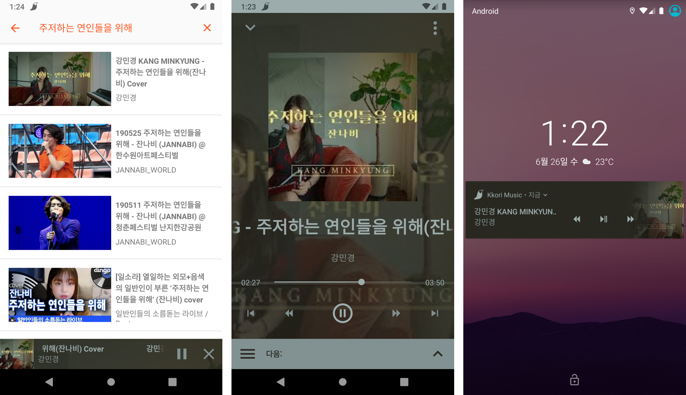
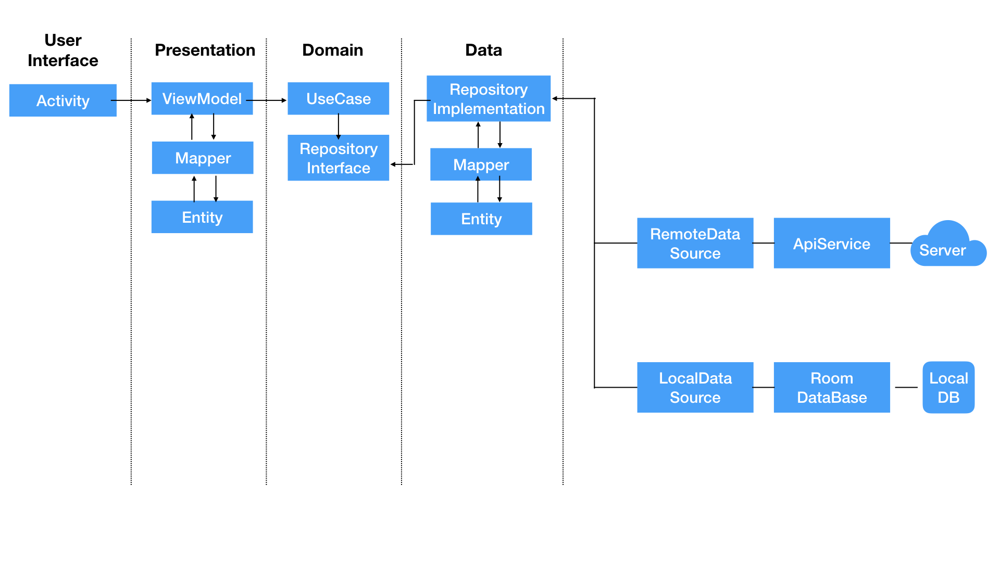

# Kkori Music

## ⚠ Warning

본 프로젝트가 접근하는 모든 동영상의 저작권은 실제 서비스를 담당하는 업체에 있으며,  
이를 유료/상업적인 목적으로 이용 시 저작권 및 법적 책임이 발생할 수 있다는 점을 명시합니다.

## 📄 README



토이 프로젝트이며,  
YouTube Data API 와 Youtube Extractor 를 활용한 음악 스트리밍 앱입니다.

### 🏆 Goal

**"엥? 이거 완전 YouTube Music 아니야?"** 할 정도의 퀼리티  

### 🚧 Current problems and Future functions

```"We will find a way. We always have." - Interstellar``` 

****Current problems****  
* 검색하고 노래누르고 뒤로가기 하면 검색바가 고장납니다.
* 노래 로딩중에 플레이어 관련 버튼 누르면 플레이어 부분이 고장납니다.
* 왜인지 모르지만 검색 결과가 있지만 검색결과가 없을때가 있습니다.(?)
* 여러 노래들을 빠르게 연속으로 로딩하면 여러부분에서 고장납니다!!
* 노래가 아에 로딩이 안될때가 있습니다.(라이브러리에 있는 파싱과정에서 Exception 이 뜰 때 일어나는 거 같습니다)
* 플레이어가 펴있는 상태에서 앱을 나갔다 들어오면 키보드가 떠있습니다.(원래 떠있으면 안됩니다...)
* 인터넷 속도(파싱 과정이 있어 인터넷 속도가 느릴수록 로딩시간은 길어집니다. 지칠정도로...)

위에 있는 적어놓은 문제점은 고칠 것입니다. 늘 그랬듯이.

****Future functions****  
* 플레이어가 접힌 상태에서 키보드 사용시, 키보드 위에 접힌 플레이어가 보이게 하기
* 재생목록
* 재생기록

### 🎯 Architecture Approach



### 🚀 Things in use and Things to be used

****Things in use****  
* Kotlin
* Android X
* Android Jetpack's navigation component
* Android Jetpack's WorkManager
* YouTube Data API v3
* Clean Architecture
* MVVM Pattern
* Data Binding
* Dagger2
* RxJava
* Android Architecture Components's Lifecycle
* MediaPlayer

****Things to be used****  
* Android Architecture Components's Room